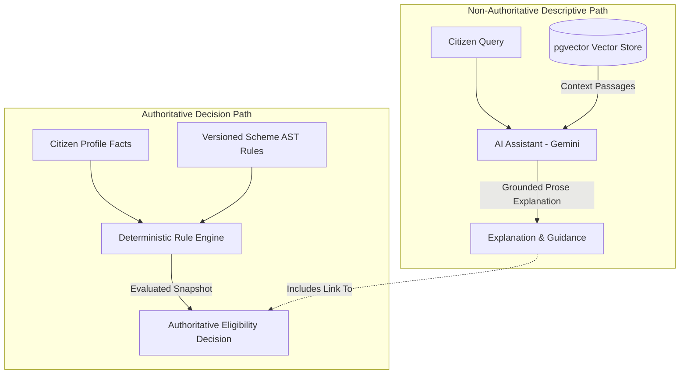

# CivicLens — AI Architecture Specification

This document defines the AI, Vector RAG, and Rule Engine boundary properties of CivicLens.

---

## Architectural Principle: AI Explains, Rule Engine Decides

> [!IMPORTANT]
> **Authoritative Boundary**: The Large Language Model (LLM) does **NOT** make authoritative eligibility decisions.
> All scheme eligibility determinations are made by the **Deterministic Rule Engine** (`app.modules.eligibility.engine`) by compiling versioned AST rules against verified citizen profile facts.

---

## Component Roles

1. **LLM Role**: Conversational interface assisting citizens in discovering schemes, answering policy questions, and summarizing requirements. Operates under strict system prompt boundaries.
2. **RAG Pipeline**:
   - **Ingestion**: Offical government publications ingested into `knowledge_sources` from vetted publisher allowlists.
   - **Chunking & Embeddings**: Normalized text chunked into passages with HNSW vector embeddings stored in PostgreSQL `pgvector`.
   - **Context Isolation**: Context passages wrapped in `<untrusted_context>` tags to neutralize prompt injection attacks inside ingested documents.
3. **Citation & Grounding**: AI responses must cite exact knowledge chunk IDs and titles. If evidence is absent in retrieved passages, the assistant must explicitly declare uncertainty rather than fabricating details.
4. **Deterministic Rule Engine**: Compiled AST evaluation (`eq`, `neq`, `gt`, `gte`, `lt`, `lte`, `in`, `between`, `exists`). Guarantees 100% reproducible decision results for identical (`profile_version`, `scheme_version`) inputs.
