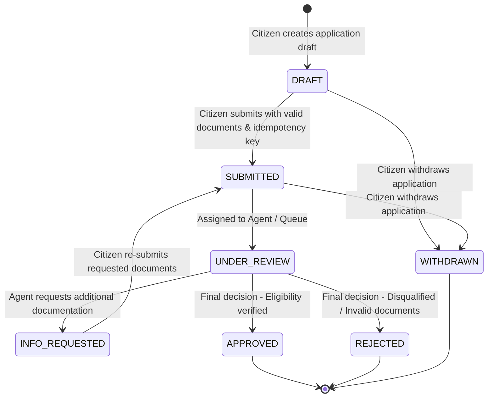

# APPLICATION STATE MACHINE SPECIFICATION

**Version:** v1.0.0-rc.2  
**Date:** 2026-08-29  

---

## State Transition Graph

---

## Allowed State Transitions Table

| Current State | Target State | Triggering User Role | Pre-conditions |
| :--- | :--- | :--- | :--- |
| `DRAFT` | `SUBMITTED` | Citizen / Agent | All mandatory documents uploaded, verified rule snapshot present, idempotency key provided. |
| `SUBMITTED` | `UNDER_REVIEW` | Agent / System | Workflow processing assigned to review queue. |
| `UNDER_REVIEW` | `INFO_REQUESTED` | Agent | Specific missing fields or unverified document flag specified. |
| `INFO_REQUESTED` | `SUBMITTED` | Citizen | Additional document / data provided. |
| `UNDER_REVIEW` | `APPROVED` | Agent / Admin | All eligibility rules passed and verification confirmed. Outbox event queued. |
| `UNDER_REVIEW` | `REJECTED` | Agent / Admin | Explicit rejection reason provided. Outbox event queued. |
| Any non-final | `WITHDRAWN` | Citizen | Citizen explicit cancellation. |

---

## Invariants & Idempotency Rules

1. **Transactional Outbox:** Every state transition that enters `APPROVED`, `REJECTED`, or `INFO_REQUESTED` atomically writes a notification event to the `outbox_events` table in the same DB transaction.
2. **Concurrent Lock:** State transitions use `SELECT ... FOR UPDATE` row locks to prevent race conditions during concurrent review actions.
3. **Terminal States:** `APPROVED`, `REJECTED`, and `WITHDRAWN` are terminal; no further state modifications are permitted once reached.
