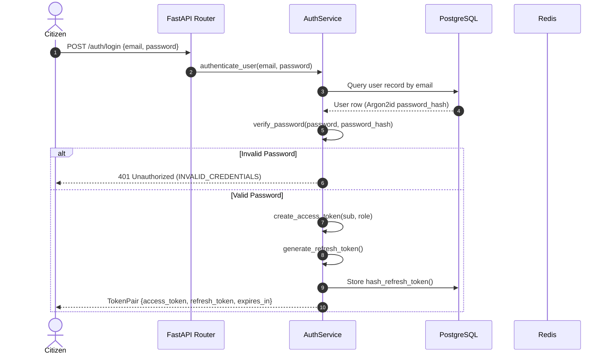
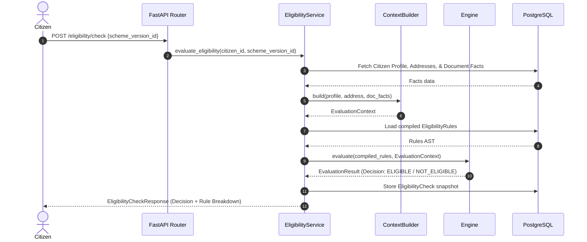
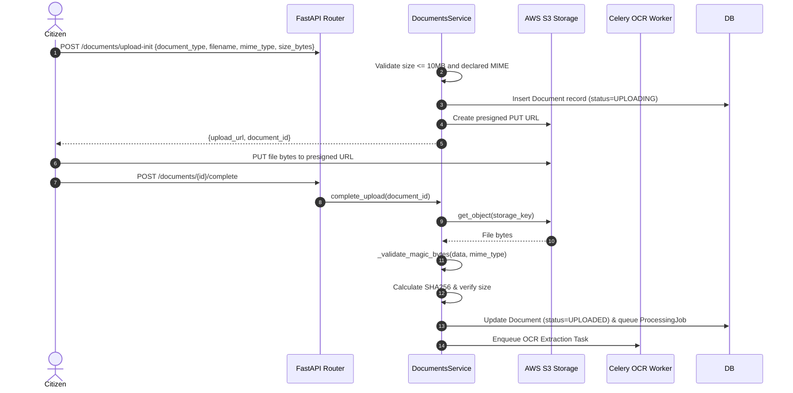
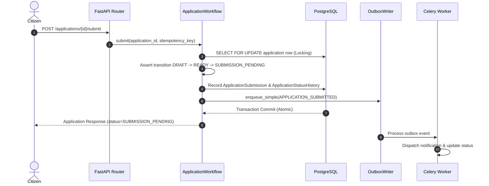

# CivicLens — Data Flow Sequence Specifications

This document details sequence flows across the major platform operations.

---

## 1. Authentication & Session Flow

---

## 2. Deterministic Eligibility Evaluation Flow

---

## 3. Document Upload & Magic Bytes Pipeline

---

## 4. Application Workflow & Outbox Event Flow

