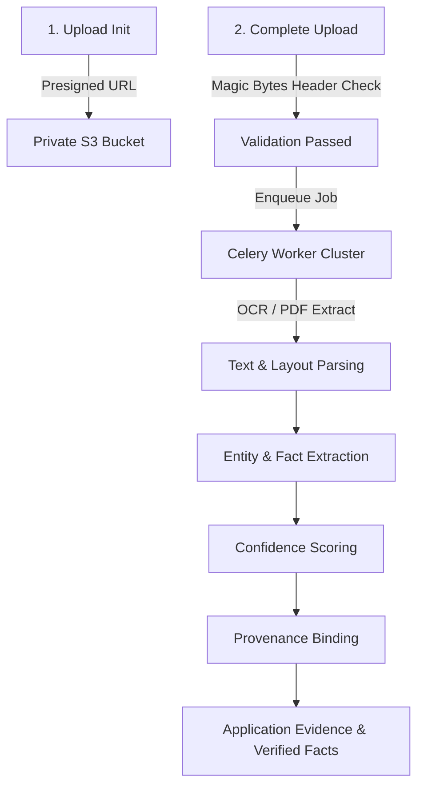

# CivicLens — Document Intelligence Architecture

This document specifies the document processing pipeline from upload to fact verification.

---

## Document Pipeline Architecture

---

## Machine Extracted vs. Human Verified Data

| Attribute | Machine Extracted Data | Human Verified Data |
|---|---|---|
| **Origin** | Automated Tesseract OCR / PDF Text Parser | CSC Operator / Admin Manual Review |
| **Trust Level** | Intermediate (requires confidence threshold >= 0.85) | Authoritative (manually confirmed) |
| **Database Flag** | `is_verified = False` | `is_verified = True`, `verified_by = operator_id` |
| **Eligibility Fact** | Used as candidate evidence for progressive profiling | Unlocks authoritative eligibility checks |
