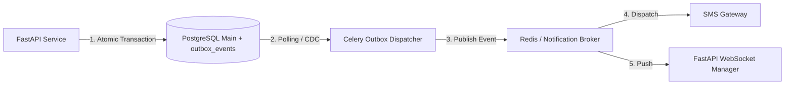

# CivicLens — Event-Driven Outbox Architecture

This document details the transactional outbox and asynchronous event processing architecture.

---

## Outbox Pattern Flow

---

## Idempotency & Failure Guarantees

- **Transactional Consistency**: `outbox_events` rows are written in the same SQL transaction as domain state mutations (e.g. Application submit). If the transaction fails, no outbox event is created.
- **Idempotency Keys**: Notifications and outbox processing handlers record `idempotency_key` in `notification_preferences` / event logs, ignoring duplicate deliveries.
- **Dead-Letter Recovery**: Events failing exceeding max retry thresholds (3 attempts) are written to `dead_letter_events` for operational review.
