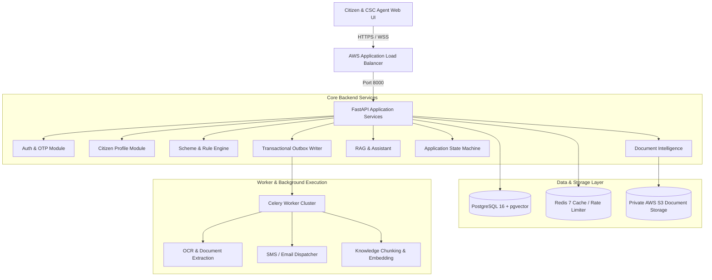

# CivicLens — System Architecture Specification

This document details the high-level and component architecture of CivicLens.

---

## 1. High-Level Architecture Diagram

---

## 2. Component Architectures

### 2.1 Frontend Architecture
- **Framework**: Next.js 14 App Router, React 18, TypeScript.
- **Applications**:
  - `apps/web`: Citizen portal for profile management, scheme discovery, eligibility assessment, AI assistant chat, document upload, application submission, and realtime notifications.
  - `apps/admin`: CSC Console / Scheme Admin dashboard for scheme creation, rule authoring, simulation, four-eyes publish review, application case management, and audit inspection.
- **State & Styling**: Vanilla TailwindCSS with responsive, dark-mode glassmorphic aesthetics.

### 2.2 Backend Architecture
- **Framework**: FastAPI (Python 3.11), SQLAlchemy 2.0 ORM, Pydantic v2 validation.
- **Modularity**: Domain-driven directory organization under `backend/app/modules/` (`auth`, `citizens`, `consents`, `schemes`, `eligibility`, `documents`, `knowledge`, `applications`, `notifications`, `admin`, `audit`).

### 2.3 AI & Rule Engine Architecture
- **Separation of Concerns**: AI (LLM) is purely descriptive, assisting citizens in understanding policies and searching knowledge. The **Rule Engine is 100% deterministic**, evaluating scheme eligibility AST rules against verified citizen profile facts.
- **Vector Search**: PostgreSQL `pgvector` with HNSW cosine distance indexing over chunked official government publications.

### 2.4 Document Intelligence Architecture
- **Validation**: Strict size caps and magic byte header inspection (`%PDF-`, `\x89PNG`, `\xFF\xD8`).
- **Processing**: Asynchronous Celery worker pipeline performing Tesseract OCR / PDF text extraction, entity parsing, confidence scoring, and fact binding.

### 2.5 Event & Realtime Architecture
- **Transactional Outbox**: Outbox records committed atomically within business database transactions.
- **Realtime Notifications**: FastAPI WebSocket connection manager pushing live event updates to authenticated clients.
