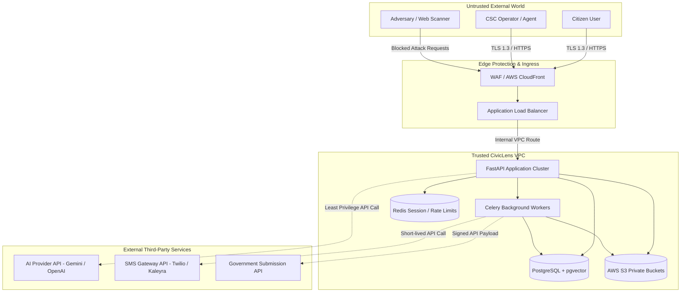

# CivicLens — System Context & Trust Boundaries

This document specifies system actor interactions and trust boundaries across untrusted, trusted, internal, and external domains.

---

## System Context Diagram

---

## Boundary Controls

| Boundary | Interface | Authentication | Authorization | Validation | Failure Policy |
|---|---|---|---|---|---|
| **Untrusted -> Edge** | HTTPS (Port 443) | WAF Rules / TLS | Rate limiting per IP | Payload size check | HTTP 429 / 403 Block |
| **Edge -> API** | HTTP/2 (Port 8000) | JWT Bearer Token | Role check (`citizen`/`agent`/`admin`) | Pydantic strict parsing | HTTP 401 / 403 Response |
| **API -> DB** | TCP (Port 5432) | PostgreSQL TLS Credentials | Least privilege IAM / SQL User | Parameterized SQL | Transaction Rollback |
| **API -> Storage** | HTTPS S3 API | IAM Task Role | Short-lived signed S3 URLs | Magic byte inspection | HTTP 422 / 400 Error |
| **API -> Worker** | Redis Protocol (6379) | Auth Secret | Internal queue isolation | Typed Outbox envelope | Retry & Dead-letter queue |
| **Worker -> External**| HTTPS REST APIs | API Key / Bearer | Strict egress allowlist | Redacted PII payload | Circuit breaker & fallback |
