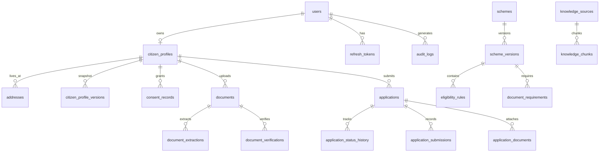

# CivicLens — Database Design & Schema ERD

This document specifies the PostgreSQL relational schema, indexes, constraints, and entity-relationship diagram.

---

## Entity-Relationship Diagram (ERD)

---

## Production Tables Summary

1. `users`: Core account identity, Argon2id `password_hash`, role (`citizen`, `agent`, `scheme_admin`, `admin`), status.
2. `citizen_profiles`: Demographics, `declared_annual_income`, `family_size`, disability status, profile completeness score.
3. `addresses`: State, district, pincode, line1, `is_primary` flag.
4. `schemes` & `scheme_versions`: Scheme metadata, effective date ranges, version status (`DRAFT`, `IN_REVIEW`, `PUBLISHED`, `SUPERSEDED`).
5. `eligibility_rules`: AST rule conditions, field keys, operators, values, parent group IDs, mandatory flags.
6. `applications`: `application_number`, status, eligibility snapshot JSON, deadline timestamps.
7. `documents`: Storage key, filename, mime type, size, SHA256 checksum, upload status.
8. `knowledge_chunks`: Text passages, section headings, HNSW vector embeddings (`pgvector`).
9. `outbox_events` & `notifications`: Transactional outbox event queue and notification feed.
