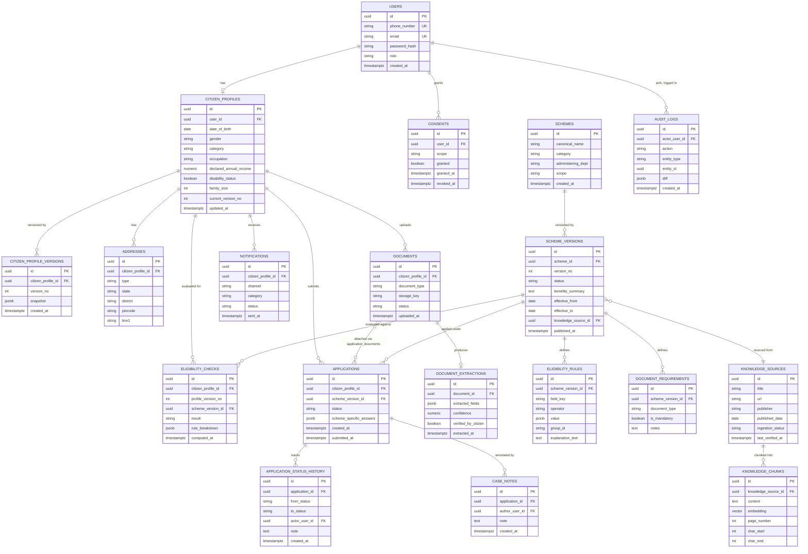

# CivicLens — Entity Relationship Diagram

Status: v1.0 draft
Related: database-design.md, data-dictionary.md

This is the authoritative ERD. `backend/app/db` SQLAlchemy models and
Alembic migrations must match this diagram; any drift is a bug, not a
documentation lag (see database-design.md §2).

## Notes on relationships not fully expressible in the diagram

- `applications` ↔ `documents` is many-to-many through an
  `application_documents` join table (which document instances were
  attached to which application) — omitted above for diagram readability,
  documented fully in data-dictionary.md.
- `eligibility_rules.group_id` supports nested AND/OR rule groups (see
  ai/rule-dsl.md) — the DSL structure, not the flat table, is the actual
  logical grouping; the table is a normalized encoding of the DSL AST.
