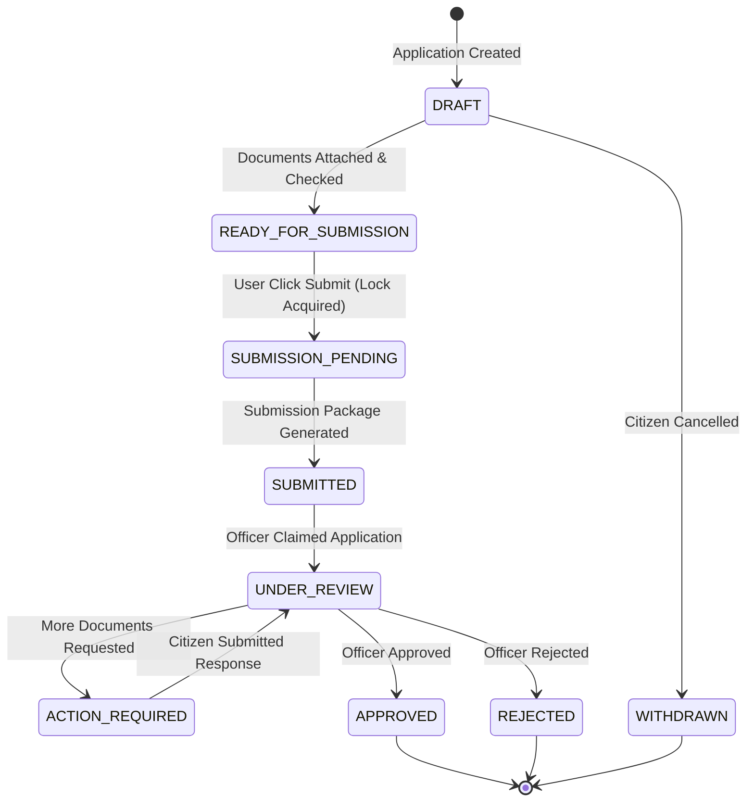

# CivicLens — Application State Machine Specification

This document specifies the formal state machine transitions, lock guarantees, and illegal transition rejection policies for application processing in CivicLens.

---

## State Transition Matrix

---

## Allowed & Rejected Transitions

| Current State | Target State | Permitted Roles | System Action | Result |
|---|---|---|---|---|
| `DRAFT` | `READY_FOR_SUBMISSION` | Citizen, Agent | Checklist Validation | **ALLOWED** |
| `READY_FOR_SUBMISSION` | `SUBMISSION_PENDING` | Citizen, Agent | Acquired SQL Row Lock (`SELECT FOR UPDATE`) | **ALLOWED** |
| `SUBMISSION_PENDING` | `SUBMITTED` | Celery Worker | Outbox Dispatch | **ALLOWED** |
| `SUBMITTED` | `UNDER_REVIEW` | Scheme Admin, Agent | Case Assignment | **ALLOWED** |
| `UNDER_REVIEW` | `APPROVED` | Scheme Admin | Record Decision & Outbox Notification | **ALLOWED** |
| `UNDER_REVIEW` | `REJECTED` | Scheme Admin | Record Decision & Outbox Notification | **ALLOWED** |
| `DRAFT` | `APPROVED` | Any | Illegal Transition Attempt | **REJECTED (`InvalidStateTransitionError`)** |
| `REJECTED` | `APPROVED` | Any | Illegal Transition Attempt | **REJECTED (`InvalidStateTransitionError`)** |
| `WITHDRAWN` | `UNDER_REVIEW` | Any | Illegal Transition Attempt | **REJECTED (`InvalidStateTransitionError`)** |
